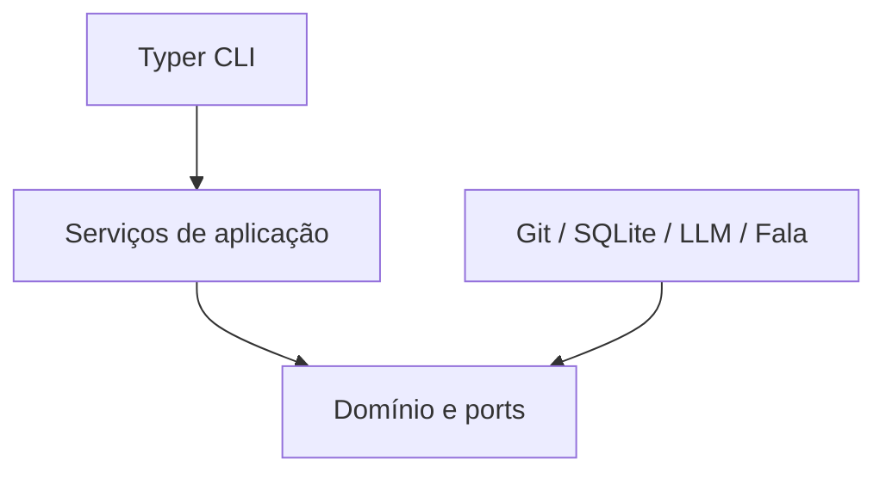
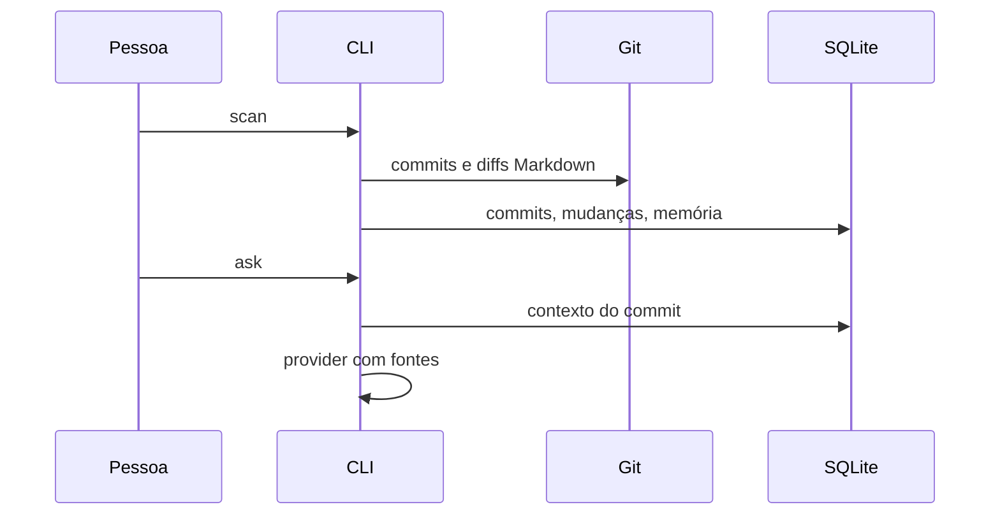

# Arquitetura

O scan usa `git rev-list` e `git diff-tree`, persiste apenas metadados e diffs Markdown em SQLite e nunca chama uma LLM. A conversa seleciona apenas blocos documentais do commit; código é selecionado por `inspect` e enviado apenas após autorização explícita. A narração usa `markdown-it-py`, normaliza blocos e persiste checkpoint local.

Workspaces temporários são criados somente pelo provider Codex e contêm `context.md` com os trechos autorizados; são removidos ao término. Não há cópia do repositório inteiro.

## Decisões arquiteturais

1. **SQLite no MVP:** é local, portátil e suficiente para estado transacional e FTS5.
2. **Sem embeddings:** caminhos, headings, Git e busca lexical atendem o MVP sem infraestrutura vetorial.
3. **Git via subprocess seguro:** reduz dependências e concentra argumentos, timeout e erros em um adapter.
4. **Workspace temporário:** isola o Codex do repositório e limita seu contexto.
5. **Docs por padrão:** evita vazamento de código em perguntas documentais.
6. **Código explícito:** `inspect` exige `--files` ou `--full-repo`.
7. **Providers por ports:** regras de negócio não importam SDKs.
8. **Codex em adapter:** `openai-codex` e seus threads não vazam do adapter.
9. **TTS local padrão:** a narração não depende de rede.
10. **Scan separado de análise:** metadata-first preserva operação offline.
11. **Memória por ancestralidade:** a seleção de commits usa a história alcançável da referência atual; expansões devem manter esse filtro.
12. **Referências validadas:** fonte é construída a partir de linhas analisadas, nunca gerada pelo provider.
13. **Hooks sem rede:** hook chama somente indexação local.
14. **Conteúdo não confiável:** prompts delimitam arquivos/diffs e proíbem seguir instruções internas.
