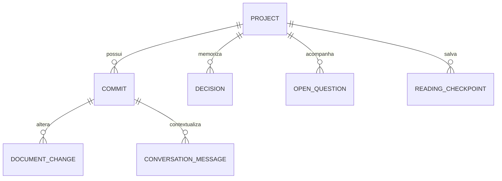

# Modelo de domínio

`Project` guarda o root canônico e diretório Git comum. `Commit` é único por projeto e hash. `DocumentChange` preserva status (incluindo rename/copy/delete), paths, contagens e diff truncável. Decisões inferidas permanecem candidatas; não são apresentadas como confirmadas. `SourceReference` contém caminho, linhas, hash e heading opcional.
